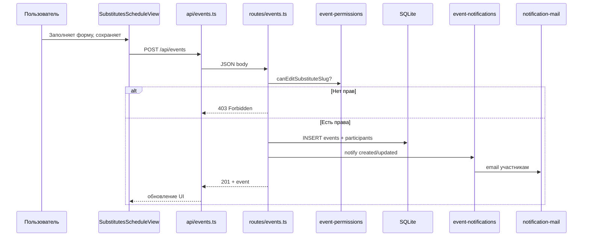
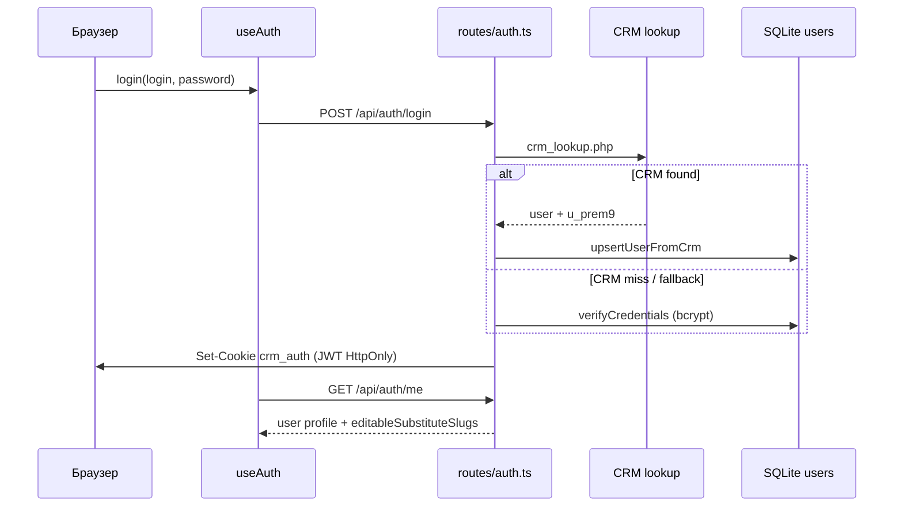

# Архитектура

## Высокоуровневая схема

Приложение следует классической схеме **SPA + REST API** с разделением данных:

```text
┌─────────────────────────────────────────────────────────────────┐
│                        Браузер (Vue 3 SPA)                       │
│  pages/ → components/schedule/ → composables/ → api/            │
└────────────────────────────┬────────────────────────────────────┘
                             │ fetch(/api/*, credentials: include)
                             ▼
┌─────────────────────────────────────────────────────────────────┐
│                     Fastify API (server/src/)                    │
│  routes/ → services/ → repositories/ → db/sqlite.ts             │
└──────┬──────────────────────────────┬─────────────────────────────┘
       │                              │
       ▼                              ▼
┌──────────────┐              ┌───────────────────┐
│ SQLite       │              │ CRM               │
│ events       │              │ HTTP: lookup,     │
│ users        │              │       participants│
│ logs         │              │       send_mail   │
│ notifications│              │ MySQL (optional)  │
└──────────────┘              └───────────────────┘
```

**Принцип:** события и метаданные приложения — в SQLite; справочник сотрудников и аутентификация — в CRM.

---

## Точка входа API

```text
server/src/index.ts
  → loadProjectDotenv()     # html/.env, затем server/.env
  → loadEnv()               # валидация zod, production guards
  → buildApp(env)
  → listen(PORT, HOST)
```

`buildApp` (`server/src/app.ts`):

1. `initDatabase` — SQLite, миграции, seed-пользователь
2. `ensureUploadDir` — каталог вложений
3. `initNotificationMail` — транспорт почты
4. Регистрация плагинов: helmet, cors, cookie, jwt, multipart
5. Декораторы `authenticate`, `requireAdmin`
6. Регистрация route-модулей с префиксом `/api`

---

## Слои бэкенда

| Слой | Каталог | Ответственность |
|------|---------|-----------------|
| **Routes** | `server/src/routes/` | HTTP: валидация (zod), коды ответов, вызов сервисов |
| **Services** | `server/src/services/` | Бизнес-логика: CRM, права, уведомления, файлы, почта |
| **Repositories** | `server/src/repositories/` | SQL-запросы к SQLite |
| **Utils** | `server/src/utils/` | Auth, CORS, видимость событий, ошибки |
| **Types** | `server/src/types/` | TypeScript-интерфейсы |
| **Constants** | `server/src/constants/` | Slugs замов, CRM-роли, цвета темы |

### Ключевые сервисы

| Сервис | Файл | Назначение |
|--------|------|------------|
| CRM Auth | `crm-auth.ts` | Lookup, SSO HMAC, маппинг ролей |
| CRM Participants | `crm-participants.ts` | Список сотрудников (HTTP / MySQL / mock) |
| Event Permissions | `event-permissions.ts` | canView, canEdit, redact hidden |
| Event Notifications | `event-notifications.ts` | In-app + email при изменениях |
| Event Reminder Worker | `event-reminder-worker.ts` | Email за 5 мин до начала (тик 60 с) |
| Notification Mail | `notification-mail.ts` | CRM PHP или sendmail |
| File Storage | `file-storage.ts` | Загрузка, magic bytes, disk I/O |
| Activity Log | `activity-log.ts` | Аудит действий |
| JWT Revocation | `jwt-revocation-store.ts` | Blacklist при logout |
| SSO Token Store | `sso-token-store.ts` | Защита от replay SSO |

---

## Точка входа фронтенда

```text
src/main.ts
  → clearLegacyAuthToken()
  → SSO из URL hash (#sso=...)
  → authBootstrap (fetchMe)
  → createRouter (file-based routes + layouts)
  → router.beforeEach (guards)
  → mount #app
```

### Слои фронтенда

| Слой | Каталог | Ответственность |
|------|---------|-----------------|
| **Pages** | `src/pages/` | Маршруты (auto-routes) |
| **Layouts** | `src/layouts/` | `default` (sidebar), `blank` (login) |
| **Components** | `src/components/` | UI: schedule, logs, notifications |
| **Composables** | `src/composables/` | Состояние: auth, permissions, API |
| **API** | `src/api/` | HTTP-клиент и доменные модули |
| **Config** | `src/config/` | Заместители, uploads |
| **Types** | `src/types/` | TypeScript для графика, логов |

---

## Поток: создание мероприятия



---

## Поток: аутентификация



Подробнее: [Аутентификация](./06-authentication.md).

---

## Фоновые процессы

| Процесс | Где | Интервал |
|---------|-----|----------|
| Напоминания о мероприятиях | `event-reminder-worker.ts` | 60 с |
| Миграции БД | `db/migrate.ts` | При старте API |

---

## Безопасность (обзор)

- JWT в **HttpOnly** cookie (`crm_auth`), не в localStorage
- **Helmet** (CSP отключён — SPA)
- **Rate limit** на health/auth (см. `routes/health.ts`, `routes/auth.ts`)
- **CORS** с `credentials: true` только для разрешённых origin
- **Multipart** лимит = `UPLOAD_MAX_BYTES`
- **Production guards**: запрет дефолтного `JWT_SECRET` и пароля `admin`
- **JWT revocation** + **auth_epoch** для инвалидации сессий
- **SSO**: HMAC, max age 60 с, one-time use

---

## Monorepo (pnpm workspace)

```yaml
# pnpm-workspace.yaml
packages:
  - 'server'
```

Корневой `package.json` — фронтенд; `server/package.json` — пакет `@crm/server`. Скрипты в корне делегируют в workspace (`pnpm --filter @crm/server`).

---

## См. также

- [Фронтенд](./04-frontend.md)
- [API](./05-api-reference.md)
- [База данных](./08-database.md)
- [Конфигурация](./09-configuration.md)
